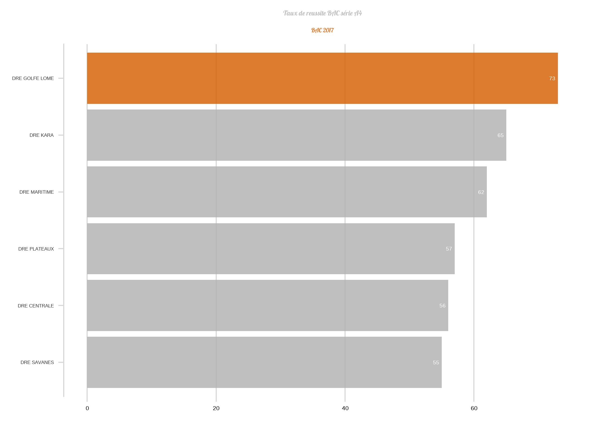

```{r setup, include=FALSE}
knitr::opts_chunk$set(collapse = TRUE,warning= FALSE, message = FALSE)
```

> "Il n'y a point de chemin vers le bonheur. Le bonheur, c'est le chemin" lao-tseu

## Contexte

Pour avoir des données organisées et cohérentes, les bases de données sont incontournables. Etant statisticien, on est plus habitué à des données à plat ou format de tableau de données du type variable en colonne et individu en ligne (comme en excel).
Lorsqu'on ne maitrise pas les outils élémentaires de Base de données, on est vite dépendant des informaticiens pour l'extraction des données nécessaires. 
L'objectif de ce post est de donner les éléments de base pour extraire les données d'une base de données avec R et Python.

## R et les bases de données

Cette partie est subdivisée en trois parties : i) connexion avec la base de données;ii) extraction des données; et iii) manipulation des données.

### Connexion à la base de données

Avec R, il existe plusieurs moyens pour se connecter à une base de données: connextion à partir de l'onglet "connections" de Rstudio, à partir de DSN (Data Source Name) et directement avec **dbconnect**. C'est cette dernière option qui sera utilisée dans ce post. Pour chaque base de données, vous avez le package approprié. (RSQLite, RPostgres, RMariaDB, Mongolite, bigrquery, odbc, ect.)
 
Pour illustrer ce post nous allons utiliser une base de données sous Ms access (oui je sais ce n'est idéal comme base de données. Nous aurons l'occasion d'utiliser PostgreSql et Postgis dans les posts à venir).

Le package **odbc** permet de se connecter à toutes les bases utilisant **odbc** drivers comme **Sql Server**, **postgresql**, **ORACLE** , **MySQL**,  **Sqlite**.

```{r}
library(DBI)
library(odbc)

# On spécifie le pilote et le chemin d'accès à la base
cs <- "Driver={Microsoft Access Driver (*.mdb, *.accdb)};DBQ=C:/Users/Samati/Desktop/r/tableau/BASE_MEPSA.mdb"
# On utilise dbConnect pour se connecter à la base
con <- dbConnect(odbc::odbc(), .connection_string = cs)
```

On peut parcourir le contenu de la connexion avec **dbListTables** et d**bListFields**.

```{r}
# La fonction dbListTables() donne la liste de l'ensemble des tables de la base de donnée/
tail(dbListTables(con), 6) # avec tail, affichons les 6 dernière table de notre base de données
head(dbListFields(con, "ETABLISSEMENT")) # afficher les champs d'une table, ici de la table établissement
```

### Extraction des données avec des requêtes

Pour extraire les données d'une base, il existe plusieurs moyens:

1. En utilisant **SQL**

Il est possible d'écrire directement les requêtes en SQL pour extraire les données avec la fonction **dbGetQuery**.
Supposons que nous voulons avoir l'effectif des élèves pas sexe et par classe

```{r}
library(tidyverse)
library(glue)

eff1 <- dbGetQuery(con,"SELECT SUM(NB_G_EFF) AS Eff_Garcon, SUM(NB_F_EFF) AS Eff_Fille
                        FROM EFFECTIF_ELEVE
                        WHERE CODE_TYPE_ANNEE = 18 AND CODE_TYPE_NIVEAU < 11
                        GROUP BY CODE_TYPE_NIVEAU
           ")
eff1
```

Il est également possible d'envoyer la requête et récupérer la réponse séparement avec les fonctions **dbSendQuery** et **dbFetch** :

```{r}
result <- dbSendQuery(con,"SELECT SUM(NB_G_EFF) AS Eff_Garcon, SUM(NB_F_EFF) AS Eff_Fille
                FROM EFFECTIF_ELEVE
                WHERE CODE_TYPE_ANNEE = 18 AND CODE_TYPE_NIVEAU < 11
                GROUP BY CODE_TYPE_NIVEAU")
eff2 <- dbFetch(result)
eff2
```

Toutes les requêtes possibles peuvent être élaborées à partir de R (les jointures, sous-requêtes, ect.)
Une autre façon, est d'utiliser les **chunk** de Rmarkdown.

2. Les requêtes dans le chunk de Rmarkdown

Avec Rmarkdown, il est possible d'inclure directement un chunk de sql dans le document en spécifiant la connexion. Depuis Rstudio 1.2, il est possible de créer un script sql dans Rmarkdown et Rstudio.

Ainsi on pourrait exécuter la même requête de la façon suivante:

```{sql connection=con, max.print = 10, cache = FALSE}
SELECT SUM(NB_G_EFF) AS Effectif_Garcon, SUM(NB_F_EFF) AS Effectif_Fille
FROM EFFECTIF_ELEVE
WHERE CODE_TYPE_ANNEE = 18 AND CODE_TYPE_NIVEAU < 11
GROUP BY CODE_TYPE_NIVEAU

```

Il est possible de socker les resultats dans un data.frame, en spécifiant l'option du chunk **output.var="Effectif"** et le nom de la data.frame

```{sql connection=con, output.var="Effectif"}
SELECT SUM(NB_G_EFF) AS Effectif_Garcon, SUM(NB_F_EFF) AS Effectif_Fille
FROM EFFECTIF_ELEVE
WHERE CODE_TYPE_ANNEE = 18 AND CODE_TYPE_NIVEAU < 11
GROUP BY CODE_TYPE_NIVEAU

```

Les resultats de la requête peuvent être utilisés comme toute autre data.frame:

```{r}
head(Effectif)
```

3. En utilisant **dbplyr**

C'est sans doute la méthode la mieux indiquée si on ne maitrise pas très bien **SQL** (Normalement SQL n'est pas difficile à apprendre. Un peu d'exercice et les ressources sont assez abondantes sur le net) mais qu'on maitrise un peu plus les fonctions de **tidyverse**

Pour pouvoir utiliser les requêtes, il faut importer chaque tables qui fera parti de la requête.
Supposons que nous voulons l'effectif des élèves par classe. 

```{r}

EFFECTIF_ELEVE <- tbl(con,'EFFECTIF_ELEVE') %>% collect() # La fonction collect() permet de sauvegarder la table en mémoire
         
Eff <- EFFECTIF_ELEVE  %>% 
  mutate(Total=NB_G_EFF+NB_F_EFF) %>% 
  filter(CODE_TYPE_NIVEAU %in% c(4,5,6,7,8,9) & CODE_TYPE_ANNEE==18) %>% 
  select(CODE_ETABLISSEMENT,CODE_TYPE_NIVEAU, Total) %>%
  pivot_wider(names_from = CODE_TYPE_NIVEAU, values_from = Total) %>%  
  rename(CP1='4',CP2='5',CE1='6',CE2='7',CM1='8',CM2='9' )  

```
Et les résultats de cette requête peuvent être utilisés pour les analyses nécessaires.

```{r, include = FALSE}
dim(Eff)
knitr::kable(head(Eff,8)) # Afficher les 8 lignes des données
```

Pour terminer cette partie, faisons  une jolie représentation graphique à partir des données d'une requête.

```{r fig.showtext=TRUE,message=FALSE,warning=FALSE}
library(showtext)
showtext_auto()
font_add_google("Lobster", "Lobster")


BAC <- tbl(con,'BAC') %>% filter(!is.na(CODE_ETABLISSEMENT)) %>% collect()

 BAC %>% 
  mutate(Recu = ifelse(Decision %in% c("ADM","Adss"),1,0)) %>% 
  filter(Annee_Bac==2017 & Série=="A4") %>% 
  group_by(DRE) %>% 
  summarise(eff=n(),admis=sum(Recu)) %>% 
  mutate(Tx_admis=round((admis/eff)*100),2) %>% 
  mutate(lome= ifelse(DRE == "DRE GOLFE LOME", TRUE, FALSE)) %>% 
  arrange(Tx_admis) %>% 
  ggplot(aes(x = reorder(DRE,Tx_admis) ,y = Tx_admis,fill=lome))+
  geom_col() +
  coord_flip() +
  geom_text(aes(label=Tx_admis),color='white',size=5,hjust=1.5) +
  cowplot::theme_minimal_vgrid(18)+
  labs(title = "Taux de reussite BAC série A4", subtitle = "BAC 2017")+
  theme(
    axis.title.y = element_blank(),
    axis.title.x = element_blank(),
    legend.position = "none",
    plot.title = element_text(size = 18, hjust = 0.5,family="Lobster", color='#B0B0B0D0'),
    plot.subtitle = element_text(size = 16, hjust = 0.5,family="Lobster", color="#D55E00D0"),
    axis.text.y = element_text(size=13,color = 'gray20'))+
  scale_fill_manual(name=NULL, values = c("#B0B0B0D0", "#D55E00D0"))
#ggsave("baci.png")
```

```{r}
#
```


Pour se deconnecter de la base, on utilise la fonction **dbDisconnect()**
```{r}
dbDisconnect(con)
```

## Python et les bases de données

Je connais essentiellement trois méthodes pour utiliser une base de données en python (si vous en connaissez d'autres, merci de l'indiquer en commentaire pour moi).

### Utilisation du cursor

Pour les deux premières méthodes, la connexion se fait de la même manière. Dans notre cas, nous allons utiliser le module **pyodbc** pour se connecter à notre base Ms access. La connexion se fait de la manière suivante:

```{python}
import pyodbc

# On spécifie le pilote et le chemin vers la base de données
conn_str = (
    r'DRIVER={Microsoft Access Driver (*.mdb, *.accdb)};'
    r'DBQ=C:/Users/Samati/Desktop/r/tableau/BASE_MEPSA.mdb;'
    )
# On utilise la fonction **connect** du module **pyodbc** pour se connecter alors la base de données.
conn = pyodbc.connect(conn_str)
# On crée le curseur de la connexion pour pouvoir éxécuter nos requête SQL
cursor = conn.cursor()
```

Pour exécuter une requête, on la passe à la fonction **execute** du curseur. On récupère  les données avec **fetchall**. Comme pour tous les fichiers dans python, on utilise une boucle pour parcourir les différentes lignes du résultat et les afficher.

```{python}
# On exécute la requête
df=cursor.execute("""
                  SELECT SUM(NB_G_EFF) AS Eff_Garcon, SUM(NB_F_EFF) AS Eff_Fille
                  FROM EFFECTIF_ELEVE
                  WHERE CODE_TYPE_ANNEE = 18 AND CODE_TYPE_NIVEAU < 11
                  GROUP BY CODE_TYPE_NIVEAU
              """)
df = cursor.fetchall()
for row in df:
    print(row)

# On arrête la connexion à la base avec close    
conn.close()
```

Cette méthode classique avec python peut être faciliter avec **pandas**. 
Le module **pandas** nous facilite grandement les différentes étapes.

### Utilisation de Pandas

Avec la fonction **read_sql_query()** de pandas, c'est plus simple de se connecter à la base de données et de récupérer les données sous forme de dataframe. On utilise juste la connexion et la requête:

```{python}
import pandas as pd

conn_str = (
    r'DRIVER={Microsoft Access Driver (*.mdb, *.accdb)};'
    r'DBQ=C:/Users/Samati/Desktop/r/tableau/BASE_MEPSA.mdb;'
    )
conn = pyodbc.connect(conn_str)

requete= """
         SELECT SUM(NB_G_EFF) AS Eff_Garcon, SUM(NB_F_EFF) AS Eff_Fille
         FROM EFFECTIF_ELEVE
         WHERE CODE_TYPE_ANNEE = 18 AND CODE_TYPE_NIVEAU < 11
         GROUP BY CODE_TYPE_NIVEAU
         """

df = pd.read_sql_query(requete,conn)

df.head()

```

On obtient donc un dataframe pour faire nos différentes analyses.


### ORM (object-relational mapper)

Cette méthode est utilisée essentiellement dans le développement des applications web avec les microservices de python comme **flask** et **django**. Ces méthodes permettent d'écrire les requêtes en python sans utiliser SQL. 
Ces aspects seront abordés lorsque nous procéderons aux développements des applications web avec python.


```{python}
conn.close()
```


