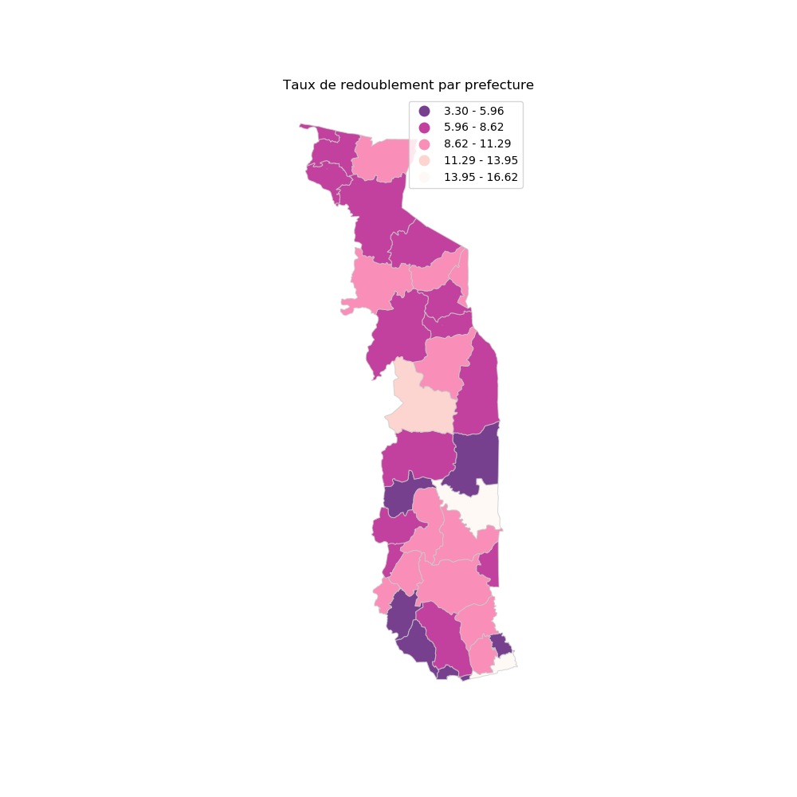

```{r setup, include=FALSE}
library(reticulate)
library(here)
knitr::opts_chunk$set(collapse = TRUE)
```


> "L'échec est le fondement de la réussite." lao-tseu

# Contexte

Cette note fait suit à la première publication sur l'introduction à la cartographie avec les outils Open Source. La première partie portait sur R et cette seconde partie porte sur Python. Python est un langage généraliste (Contrairement à R, non spécifique au Data Science) avec des packages spécifiques pour chaque domaine. Par exemple, on a **Pandas** pour Data Science, **GeoPandas** pour la manipulation des données géographiques, **Flask** et **Django** pour le développement web, etc.

Ce post est subdivisé en deux grandes parties: la première partie porte sur l'importation et manipulation des données avec python et la deuxième partie porte sur la représentation géographique des données importées.

# Importations et manipulations des données 

Nous allons utiliser le package **GeoPandas** pour les données cartographiques et le package **Pandas** pour la manipulation des données liées aux écoles.

## L'importation des données Geographiques

Le package **geopandas** est une extension du package **pandas** dédié à la manipulation des données géographique. Ainsi, pour importer la carte des préfecture du Togo, on procède ainsi

```{python,message=FALSE,warning=FALSE}
import pandas as pd # Pour la manipulation des données
import numpy as np # Pour les calculs scientifiques
import geopandas as gpd # Pour l'importation et la manipulation des données géographiques
import matplotlib.pyplot as plt # pour la représentation graphique

carte = gpd.read_file(r'C:/Users/Samati/Desktop/r/geo/TGO_l04_2012.shp') # pour l'importation

```
On peut regarder les 5 premières lignes de notre donnée avec la fonction *head()* :

```{python,message=FALSE,warning=FALSE}
carte.head()
```

Comme pour le package **sf** de R, c'est un DataFrame spécial avec une colonne spéciale, **geometry** qui contient les données géographiques (Point, Polygon, etc.)

Une idée de la carte des préfectures importée se fait à l'aide de la fonction *plot*:

```{python,carte1,message=FALSE,warning=FALSE}
carte.plot(figsize=(12,12))
plt.title("Carte des préfectures du Togo")
plt.savefig('carte1.png')
```


```{r,fig.align='center',message=FALSE,warning=FALSE,echo=FALSE}
#
#knitr::include_graphics('/img/carte1.png')
```

Avant d'utiliser ces données, faisons un peu d'apurement de la colonne préfecture qui nous servira de fusion avec les données liées aux écoles:
- Dans un premier temps, nous remplaçons les tirets par underscore;
- Ensuite, bien écrire la préfecture MO qui était écrit avec accent;
- Enfin convertir toutes les modalités de préfecture en majuscule.

```{python,message=FALSE,warning=FALSE}
carte['PREFECTURE'] = carte['PREFECTURE'].str.replace("-","_")
carte['PREFECTURE'] = carte['PREFECTURE'].str.replace(r"S/p_M\x93","MO",regex=True)
carte['PREFECTURE'] = carte['PREFECTURE'].str.upper()
```


## Importation des informations sur les écoles 

## 1. Importation des données pour calculer le taux de redoublement

Nous utilisons **pandas** pour importer les données sous format csv comme ceci:

```{python,message=FALSE,warning=FALSE}
df = pd.read_csv(r'C:/Users/Samati/Desktop/r/geo/primaire_geo.csv',sep=';',encoding= 'Latin-1')

```

Un peu d'apurement ici également:
- Remplacer les espaces par underscore;
- Regrouper les arrondissements sous Lomé-commune;
- Enfin convertir toutes les modalités de préfecture en majuscule.

```{python,message=FALSE,warning=FALSE}
df['PREFECTURE'] = df['PREFECTURE'].str.replace(" ","_")
df['PREFECTURE'] = df['PREFECTURE'].str.upper()

```

On crée une nouvelle base de données pour calculer le taux de redoublement par préfecture (en faisant un regroupement avec la fonction **groupby()**) afin de les importer dans la base géographique.

```{python,message=FALSE,warning=FALSE}
base = df.groupby('PREFECTURE').sum().reset_index() # On regroupe les données par préfecture
base['Tx_redoublement'] = 100*(base['red_G_AN2'] + base['red_F_AN2'])/(base['Effectif_F_AN1'] + base['Effectif_G_AN1'])# On calcul le taux de redoublement par préfecture

```

et on a la base prête pour la fusion:

```{python,message=FALSE,warning=FALSE}
base.describe()
```


### 2. La fusion

On peut fusionner alors les données géographiques avec le taux de redoublement suivant les préfectures. 

```{python,message=FALSE,warning=FALSE}
prefecture = base.merge(carte, on = "PREFECTURE", how='left')
prefecture = gpd.GeoDataFrame(prefecture) # On convertit la base en objet geopandas
```

# Représentation graphique

Il y a une multitude de packages pour la représentation graphique en python: **plotly, seaborn, altair, bokeh**, etc. Nous en utiliserons certains pour illustrer cette partie. Dans un premier temps nous allons aborder les cartes statiques et ensuite les cartes interactives.

## La représentation statique

Le package **Matplotlib** est la base de la représentation graphique en python. Il existe extensions de **Matplotlib** pour la représentation graphique.

### La représentation avec Matplotlib*

Matplotlib (et les packages associés) proposent les éléments nécessaires pour la représentation graphique et les personnalisations nécessaires.
La fonction **plot** appliquée à notre objet préfecture, permet d'avoir une représentation de base de notre carte.

*1. Choropleth*

On peut faire une carte thématique avec les données par préfecture en spécifiant la colonne (ici le taux de redoublement par préfecture) :

```{python,message=FALSE,warning=FALSE}
from mapclassify import Quantiles, EqualInterval
prefecture.plot(figsize=(12,12),column='Tx_redoublement', scheme='EqualInterval', alpha=0.75, k=5,cmap=plt.cm.RdPu_r,linewidth = 0.8,edgecolor='0.8', legend = True)
plt.axis('off') # Enlever les axes
plt.title('Taux de redoublement par prefecture') # Ajouter un titre à la carte
plt.savefig('carte2.png') #Enregister la carte

```


```{r,fig.align='center',message=FALSE,warning=FALSE,echo=FALSE}
#
#knitr::include_graphics('/img/carte2.png')
```

Cette carte de base peut être améliorer en ajoutant, les éléments nécessaires. (consulter l'aide du package)

On pourrait faire la même représentation avec un histogramme de la distribution du taux de redoublement (pris [ici](http://darribas.org/gds19/index.html) de Dani Arribas-Bel).

```{python,message=FALSE,warning=FALSE}
import seaborn as sns
import mapclassify

def plot_scheme(scheme, var, db, figsize=(16, 8), saveto=None):
    
    schemes = {'equal_interval': EqualInterval, \
               'quantiles': Quantiles}
    classi = schemes[scheme](db[var], k=7)
    f, (ax1, ax2) = plt.subplots(1, 2, figsize=figsize)
    # KDE
    sns.kdeplot(db[var], shade=True, color='purple', ax=ax1)
    sns.rugplot(db[var], alpha=0.5, color='purple', ax=ax1)
    for cut in classi.bins:
        ax1.axvline(cut, color='blue', linewidth=0.75)
    ax1.set_title('La distribution du tx de redoublement')
    # Map
    p = db.plot(column=var, scheme=scheme, alpha=0.75, k=7, \
             cmap=plt.cm.RdPu_r, ax=ax2, linewidth=0.1)
    ax2.axis('equal')
    ax2.set_axis_off()
    ax2.set_title('Tx de redoublement par prefecture')
    f.suptitle(scheme, size=25)
    if saveto:
        plt.savefig(saveto)

    

carte4 = plot_scheme('quantiles', 'Tx_redoublement',prefecture,figsize = (13, 13), saveto="carte3.png")

```


```{r,fig.align='center',message=FALSE,warning=FALSE,echo=FALSE}
#
#knitr::include_graphics('/img/carte3.png')
```


### 2. Représentation ponctuelle

Dans cette partie, nous allons représenter les écoles sur la carte des préfectures. Dans un premier temps on convertit les colonnes longitude et latitude en objet geopandas.


```{python,message=FALSE,warning=FALSE}
ecole = gpd.GeoDataFrame(df, geometry=gpd.points_from_xy(df.long,df.lat))
ecole.crs = {'init': 'epsg:4326'}
```

On représente les deux couches superposées comme ceci

```{python,message=FALSE,warning=FALSE}
ax = carte.plot(figsize=(15,15),color='whitesmoke', linestyle=':',edgecolor = 'black')
carte3 = ecole.plot(figsize=(15,15),markersize=1, ax=ax)
plt.axis('off')
plt.title('Distribustion des écoles par prefecture')
plt.savefig('carte4.png')
#figsize=(10,10),to_crs(epsg=32630).

```


```{r,fig.align='center',message=FALSE,warning=FALSE,echo=FALSE}
#
#knitr::include_graphics('/img/carte4.png')
```

On pourrait représenter la variable taux de redoublement par école comme ceci. Dans un premier temps, on restreint nos données à la région de la savanes, ensuite on calcule le taux de redoublement et en fin on représente les deux couches superposées.

```{python,message=FALSE,warning=FALSE}

savanes_carte = carte.loc[carte.REGION =='SAVANES'] 
savanes = df.loc[df.REGION =='SAVANES']

savanes['Tx_redoublement'] =1000*(savanes['red_G_AN2']+(savanes['red_F_AN2']))/(savanes['Effectif_F_AN1']+(savanes['Effectif_G_AN1']))

ax = savanes_carte.plot(figsize = (12,12), color='whitesmoke', linestyle=':',edgecolor = 'black')
ax.scatter(savanes.long,savanes.lat,s=savanes.Tx_redoublement,alpha=0.5)
plt.axis('off')
plt.title('Taux de redoublement par école dans la région des savanes')
plt.savefig('carte5.png')

```


```{r,fig.align='center',message=FALSE,warning=FALSE,echo=FALSE}
#
#knitr::include_graphics('/img/carte4.png')
```


### La représentation avec Altair

C'est le package que je préfère le plus pour sa simplicité de codes mais la qualité de la représentation graphique est assez intéressante. Il permet la représentation statistique et interactives. 


```{python}
import altair as alt
import gpdvega

stat = alt.Chart(prefecture).mark_geoshape(
          ).encode( 
            color = 'Tx_redoublement:Q'
          ).properties( 
            width = 300,
            height = 500,
            title = 'Taux de redoublement par Prefecture'
          ).to_json()

```

Remarquer la qualité de la couleur par rapport au package **Matplotlib**

```{r , echo=FALSE,fig.align='center'}
library(vegawidget)
as_vegaspec(py$stat)
```


# La représentation interactive

Les packages **plotly**, **folium** et **altair** permettront d'illustrer cette partie.

Le package altair permet de faire des cartes interactives avec seulement quelques lignes de codes. Ici nous ajoutons à notre code précédent l'option tooltip pour afficher la préfecture et le taux de redoublement.


```{python}
stata = alt.Chart(prefecture).mark_geoshape(
          ).encode( 
            color ='Tx_redoublement:Q', 
            tooltip = ['PREFECTURE:N','Tx_redoublement:Q']
          ).properties( 
            width = 300,
            height = 500,
            title = 'Taux de redoublement par Prefecture'
          ).to_json()
```
Les chiffres Q et N devant les variables precisent leur type:
- Q : Quantitative;
- N : Nominale;
- O : ordonnée;
- T : temporelle.

```{r,echo=FALSE,fig.align='center'}
as_vegaspec(py$stata)
```


Le package **Folium** est l'adaptation du package leaflet de Javascipt en python. Nous reviendrons sur le package leaflet dans la troisième partie de cette serie sur les représentations graphiques avec les outils open source.